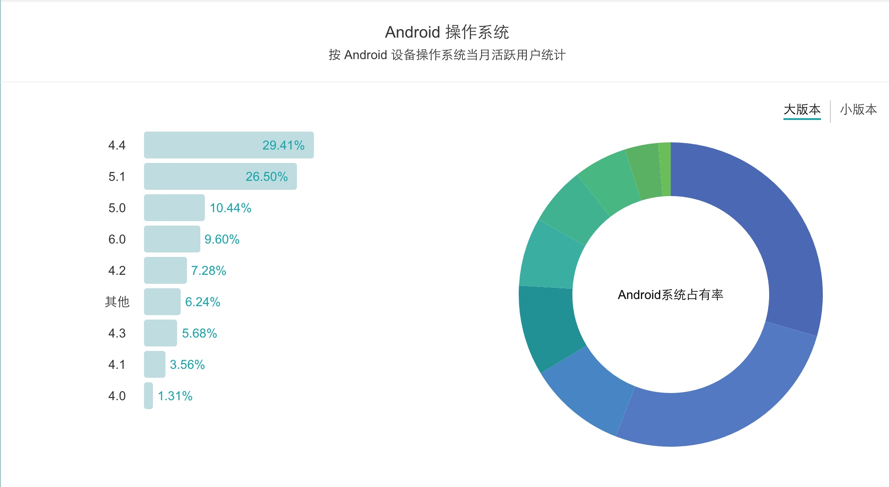

# 了解 Android

## Andorid简史
### Android1.0
2008年9月22日，谷歌正式对外发布第一款Android手机——HTC G1。
9月23日，谷歌发布Android1.0

这里不纠结Android1.0是不是最低版本。反正面市的这是最低版本。
我们也可以看出来Android设计的初衷是全键盘。也就是说Android 最开始的模仿对象是诺基亚。可惜诺基亚已经死了。但是可以看出G1是一款高效率的生成力工具，而非简单的智能手机。
现在的手机更注重设计，体验。
###  Android 1.5（Cupcake纸杯蛋糕）
** 特性:**
1. 增加了对虚拟键盘的支持
2. 增加了视频录制功能
3. 支持了Widget
4. 改进GPS功能，定位库使用A-GPS技术
5. 增加了英文语音识别功能
6. 重力加速感应器增加了自动探测方向的支持
7. 内置Google Chrome Lite浏览器。JS内核 SquirellFish
8. 支持包括中文在内的十多种语言。1.1只支持 英语和德语
###  Android 1.6（Donut甜甜圈）
**特性**
1. 支持CDMA网络。之前只支持GSM和WCMDA
2. tts 支持更多的语言。没有汉语。
3. 应用程序耗电查看
4. 新增面向视觉或听觉困难人群的易用性插件
5. linux内核升级到2.6.29
6. 支持更多的屏幕分辨率。

###  Android 2.0 （2.0~2.1 Eclair松饼（闪电泡芙））
09.10.26
**特性**
1. 流畅性得到很大的提升，源于文件结构的改动优化
2. Chrome Lite加入双击屏幕缩放
###  Android 2.1
**特性**
1. 添加VPN
###  Android 2.2(Froyo冻酸奶)
**特性**
1. 全面支持 Flash10.1
2. App自动升级
3. 支持App安装到外置内存上
4. linux内核2.6.32
5. 3D性能优化
6. FM功能全面支持
7. 支持USB/蓝牙键盘

###  Android 2.3(2.3 Gingerbread姜饼)
**特性**
1. 进程管理
2. NFC
3. 支持前置摄像头
4. 支持SIP网络电脑
5. 输入法框架由JAVA实现变为C实现

###  Android3.0到3.1(3.0 Honeycomb 蜂巢)：
失败
###  Android4.0(4.0 Ice CreamSandwich)
**特性**
1. 支持手机 平板 电视等设备
2. 修UI
3. 新的Roboto字体
4. 人脸识别，刷脸解锁
5. 多任务列表
6. Android Beam
### Android 4.1
性能优化
### Android 4.2
**特性**
1. 优化浏览器
2. 全新的文件管理器
3. Android 4.2.1更新 修复无法选择12月的BUG
### Android 4.4
**特性**
1. App运行方式加入ART模式
2. 针对RAM的
3.  无线打印
4.  图标风格也进一步扁平化
5. 支持Emoji键盘
6. 屏幕录像功能
7. 内置字幕管理功能
8. 内置字幕管理功能
9. 内置字幕管理功能
###  Android 5.0
**特性**
1. linux内核3.0
2. 多核处理器优化
3. 全新Material Design设计风格
4. 全新的通知中心设计
5. 支持64位ART虚拟机
双核cpu的到来
###  Android 6.0
**特性**
1. 指纹识别
2. 更完整的应用权限管理
3. Doze电量管理
4. 更流畅的动画
5. 支持快速充电的切换
6. 支持RAW格式照片
###  Android 7.0
**特性**
1. 分屏多任务
2. Data Saver
3. 号码拦截
4. 夜间模式
5. Java8支持
6. 画中画模式（电视）

## Android在国内的版本分布情况

\> 4.0  92.45%
虽然Android的碎片化很严重，但是目前来说，其实还好。
开发，总是就有难度的。没有难度，怎么会有挑战性呢。

下面开始开发吧
<https://developer.android.com/index.html>

**个人观点：**
1. 对于一个好的开发者，最需要了解的是设计。
2. 其次才是开发。
3. 这样才有可能做一个很好的开发者，而不仅仅是一个合格的开发者。

## 快速入门教程
0. 开发工具 Android Studio
1. 开发语言 java 快速入门，自己想办法
2. 官方教程  <https://developer.android.com/training/index.html>
3. 设计指南 <https://developer.android.com/design/index.html>
4. Api指南 <https://developer.android.com/guide/index.html>
5. Api参考 <https://developer.android.com/reference/packages.html>
6. samples <https://developer.android.com/samples/index.html>
7. studio <https://developer.android.com/studio/index.html>
8. NDK <https://developer.android.com/ndk/index.html>

官方的教程可以让一个正常水平的开发者很快的进入初级开发，只要快速学习，练习。最主要的是强烈的兴趣。

我的定义，学完基础教程只是来到了门前，离推门进来还是有一门的距离。

如何入门，看下一章