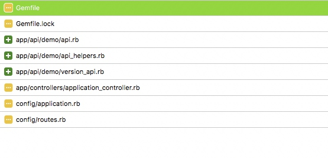

[TOC]
 初始化项目只是保证了项目最小可用。
接下来要分析这个后台服务要提供那些服务，然后再完善。
## web
初始化的项目就可以了。
## api
```
gem "grape"
gem "grape-jbuilder"
gem "grape-swagger"
gem 'hashie-forbidden_attributes'
gem 'grape-api-generator'
```
## 公众号
```
gem 'weixin_authorize', github: "gaoshuaipeng/weixin_authorize"
gem 'weui-rails'
```
## web + api + 公众号
```
gem "grape"
gem "grape-jbuilder"
gem "grape-swagger"
gem 'hashie-forbidden_attributes'
gem 'grape-api-generator'

gem 'weixin_authorize', github: "gaoshuaipeng/weixin_authorize"
gem 'weui-rails'
```
接下来我选择web + api这种方式。加入grape，
**参看官方文档**
## grape 快速添加
**terminal log:**

### Gemfile
```ruby
gem 'kaminari-bootstrap'
```

### app/api/demo/api.rb 
```ruby
#encoding: utf-8
module Demo
  class Api < Grape::API
    include Grape::Kaminari
    prefix 'api'
    version 'v1', :using => :path, :vendor => 'demo'
    format :json
    helpers Demo::APIHelpers

    before do
      header['Access-Control-Allow-Origin'] = '*'
      header['Access-Control-Allow-Headers'] = '*'
      header['Access-Control-Allow-Methods'] = '*'
    end

    before do
      unless env["REQUEST_METHOD"] == "OPTIONS"
        skip_check = []
        unless skip_check.any? { |path| env['PATH_INFO'].include?(path) }
          authenticate!
        end
      end
    end

    error_formatter :json, lambda { |message, backtrace, options, env|
      Rails.logger.error "error: #{message}"
      {error: message}
    }

    rescue_from Grape::Exceptions::Validation do |e|
      Rack::Response.new({
                             'status' => "error",
                             'message' => e.message,
                             'errors' => [e.param]
                         }.to_json, 400)
    end

    rescue_from :all do |e|
      Rails.logger.error e
      Rails.logger.error e.backtrace.join("\n")
      Rack::Response.new({
                             'status' => "error",
                             'message' => e.message,
                             'backtrace' => e.backtrace

                         }.to_json, 500)
    end

    mount Demo::VersionApi
    
    add_swagger_documentation
  end

end
```

###  app/api/demo/api_helpers.rb
```ruby
#encoding: utf-8

module Demo

  module APIHelpers

    def current_user
      @current_user = AdminUser.first # just for test
    end


    def authenticate!
      error!({status: 'error', errors: ["Unauthorized"]}, 401) unless current_user
    end

  end
end
```

### app/api/demo/version_api.rb
```ruby
#encoding: utf-8
module Demo
  class VersionApi < Grape::API
    resource :version do
      get '/info' do
        #current_version
        {status: "ok", client_version: "1.0.0", server_version: "1.0.0"}
      end
    end
  end
end
```

###  app/controllers/application_controller.rb
```ruby
  before_filter :cors_preflight_check
  after_filter :cors_set_access_control_headers

  def cors_preflight_check
    if request.method == :options
      headers['Access-Control-Allow-Headers'] = 'Origin, X-Requested-With, Content-Type, Accept, Authorization, access_token'
      headers['Access-Control-Allow-Methods'] = 'POST, GET, OPTIONS'
      headers['Access-Control-Request-Method'] = '*'
      headers['Access-Control-Allow-Headers'] = '*'
      headers['Access-Control-Max-Age'] = '1728000'
      render :text => '', :content_type => 'text/plain'
    end
  end

  def cors_set_access_control_headers
    headers['Access-Control-Allow-Origin'] = '*'
    headers['Access-Control-Allow-Methods'] = 'POST, GET, OPTIONS'
    headers['Access-Control-Allow-Headers'] = '*'
    headers['Access-Control-Max-Age'] = "1728000"
  end
```

###  config/application.rb
```ruby
    config.middleware.use(Rack::Config) do |env|
      env['api.tilt.root'] = Rails.root.join "app", "views", "api"
    end
    
```
###  config/routes.rb

```ruby
  mount Demo::Api => "/"
```