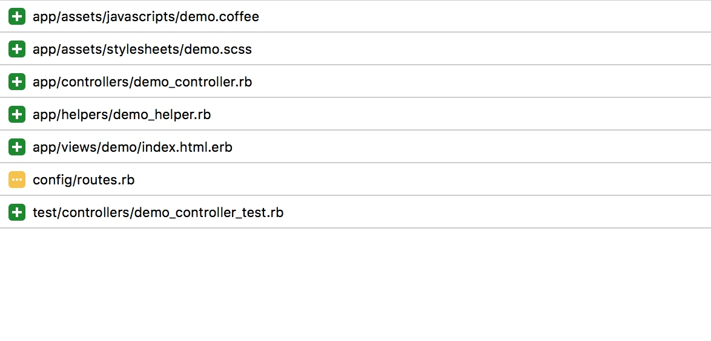
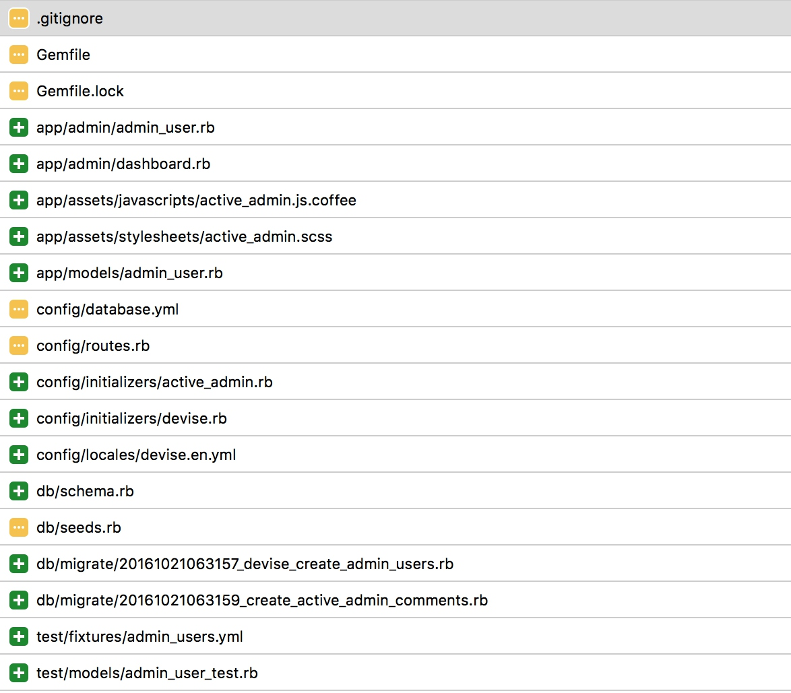
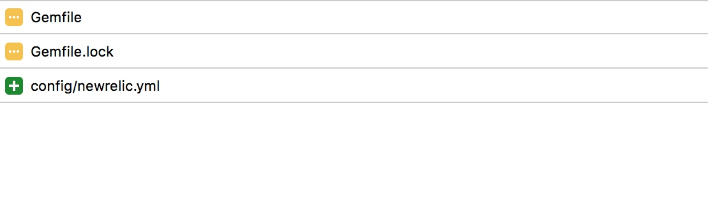
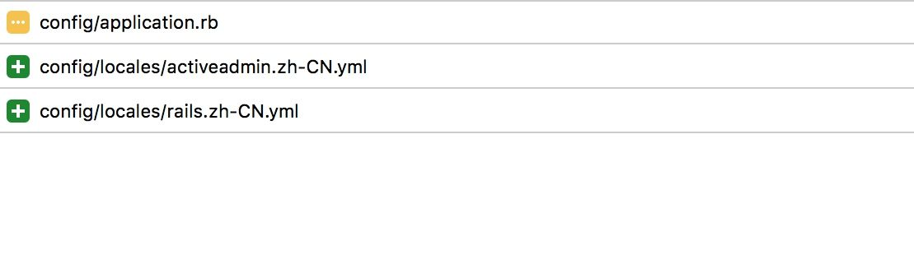

[TOC]
# 日常开发
本demo基于rails v4.2.6创作。
## 从零开始
1\. 初始化项目
`rails new demo`
2\. 添加一个demo controller
`rails g controller Demo index`
**terminal log:**

3\. activerecord-mysql2spatial-adapter
gemfile
` gem "activerecord-mysql2spatial-adapter", github:"fjl82/activerecord-mysql2spatial-adapter"`
4\. add gem activeadmin
[installation](https://github.com/activeadmin/activeadmin/blob/master/docs/0-installation.md)
file Gemfile
```
gem 'activeadmin'
# Plus integrations with:
gem 'devise'
gem 'cancan' # or cancancan
gem 'draper'
gem 'pundit'
```
```shell
rails g active_admin:install
```
**terminal log:**


```shell
rake db:migrate
rake db:seed
```
5\. 针对线上环境设置
** config/initializers/devise.rb**
`config.secret_key = 'xxx'`
**config/secrets.yml**
`secret_key_base: 'xxx'`
**config/environments/production.rb**
`config.serve_static_files = true #todo 好的做法 nginx转发`
6\. newrelic(apm)
file Gemfile
`gem 'newrelic_rpm'`
**terminal log:**

7\. active_admin_theme
active_admin官方的主题实在是太丑了。
这个至少能看。
8\. 调整默认语言 汉化。
**config/application.rb**
```shell
    config.i18n.available_locales = [:"zh-CN", :en]
    config.i18n.default_locale = :"zh-CN"
```
9\. 时间本地化
**config/application.rb**
```
    config.active_record.default_timezone = :local
    config.time_zone = 'Beijing'
```
active_admin遇到部分问题
解决方式，如下图。

